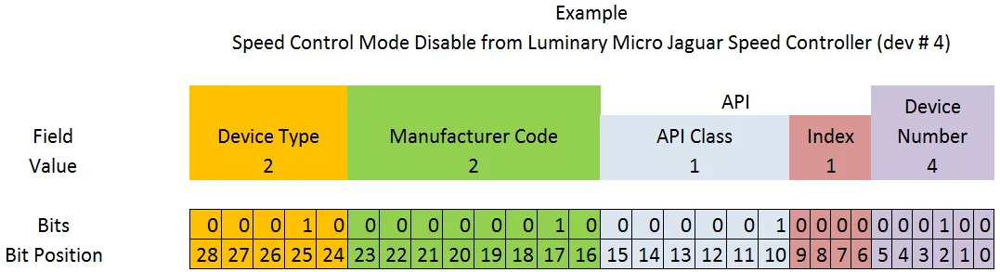

Device Type
* `01010` - 10 - Miscellaneous
Manufacturer Code
* `00001000` - 8 - Team use (should tots hit up FIRST for a JeMo manufacturer code)
API
* [Identify](./identify)
* [Write Setting](./write)
* [Report Setting](./report)
* [Fetch Setting](./fetch)
* [[Status]]
* [[Clear Sticky Faults]]
* [[Upload Firmware]]
* [[Set Animation]]
* [[Upload Animation]]
* [[Delete Animation]]
Device ID - An identifier to discriminate between multiple of the same device.
* `xxxxxx` - 0-63

